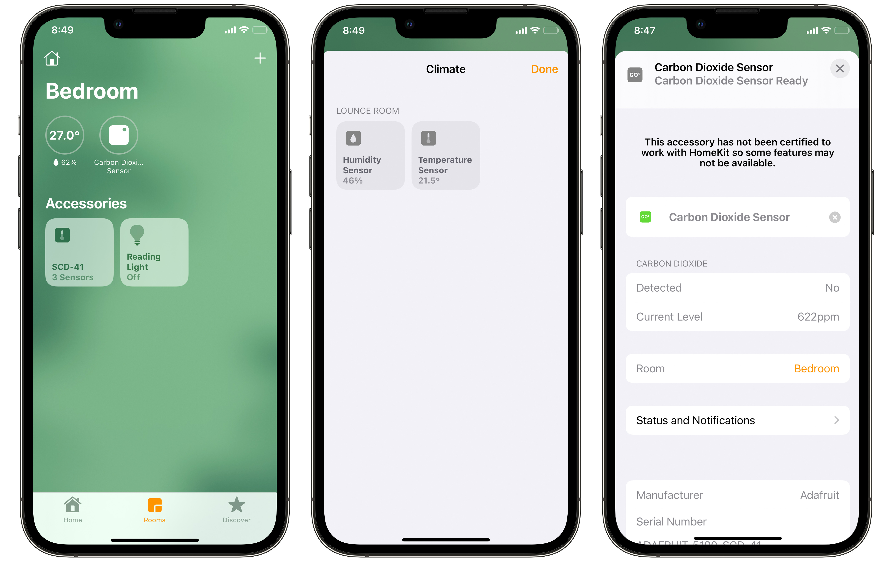

# HomeKit SCD4x

An [Apple HomeKit](https://developer.apple.com/homekit/) accessory for the [SCD4x](https://www.adafruit.com/product/5190) temperature and humidity sensor running on a Raspberry Pi.

## Dependencies

* [**Go**](http://golang.org/doc/install) - this accessory is written in Go
* [**HomeControl**](https://github.com/brutella/hc) - to expose climate readings from the Enviro+ as an Apple HomeKit accessory
* [**ESP32 exporter**](https://github.com/sighmon/co2_sensor_scd4x_esp32_http_server) - to read the SCD4x sensor and export it for scraping by [Prometheus](https://prometheus.io)

## Installation

Install this on a Raspberry Pi, or test it on macOS.

### Setup

1. Install [Go](http://golang.org/doc/install) >= 1.14 ([useful Gist](https://gist.github.com/pcgeek86/0206d688e6760fe4504ba405024e887c) for Raspberry Pi)
1. Clone this project: `git clone https://github.com/sighmon/homekit-scd4x` and then `cd homekit-scd4x`
1. Install the Go dependencies: `go get`
1. Install and run the Climate Sensor exporter [climate-sensor](https://github.com/ACMILabs/climate-sensor)

### Build

1. To build this accessory: `go build homekit-scd4x.go`
1. To cross-compile for Raspberry Pi on macOS: `env GOOS=linux GOARCH=arm GOARM=7 go build homekit-scd4x.go`

### Run

1. Execute the executable: `./homekit-scd4x`
1. Or run with the command: `go run homekit-scd4x.go`

### Start automatically at boot

1. sudo cp homekit-scd4x.service /lib/systemd/system/homekit-scd4x.service
2. sudo systemctl daemon-reload
3. sudo systemctl enable homekit-scd4x.service
4. sudo systemctl start homekit-scd4x.service

### Optional flags

The flag defaults can be overridden by handing them in at runtime:

* `-host=http://0.0.0.0` The host of your SCD4x sensor
* `-port=1006` The port of your SCD4x sensor
* `-sleep=5s` The [time](https://golang.org/pkg/time/#ParseDuration) between updating the accessory with sensor readings (`5s` equals five seconds)
* `-dev` This turns on development mode to return a random temperature reading without needing to have a SCD4x

e.g. to override the port run: `go run homekit-scd4x.go -port=8000` or `./homekit-scd4x -port=8000`

## Reset this accessory

If you uninstall this accessory from your Apple Home, you'll also need to delete the stored data for it to be able to be re-added.

### macOS

1. Delete the data in the folder created: `homekit-scd4x/SCD-41/` 
1. Restart the executable

### Raspberry Pi

1. Remove the persistent data: `rm -rf /var/lib/homekit-scd4x/data`
1. Restart the Raspberry Pi

## Thanks

This project uses the amazing work of [Matthias](https://github.com/brutella). Please consider donating if you found this useful.
